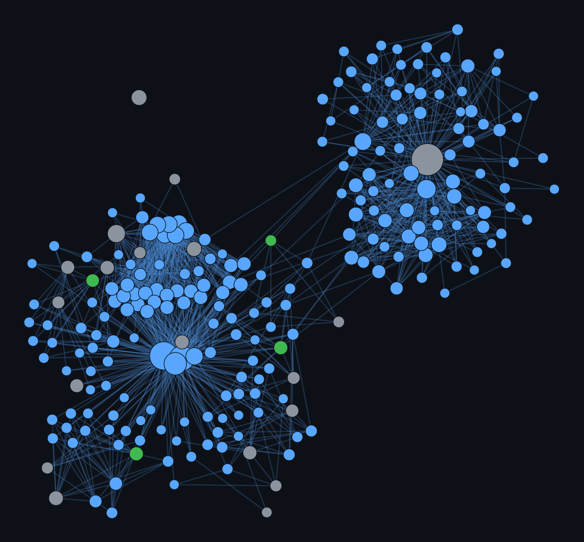

# 🧠 CodeGraph Explorer — Script-First (v4.6)

*🇬🇧 English · [🇫🇷 Français](README.fr.md)*

A skill for Claude Code, inspired by **Graphify** and **Understand Anything**.

<p align="center">
  
  <br>
  <em>CodeGraph run on its own source tree — <code>graph.html</code>, the self-contained interactive view (<a href="docs/graph-preview.svg">SVG</a>).</em>
</p>

## 🎯 Philosophy: Zero Token Waste

> **Claude never parses source code. It runs a local Python script once, then reads the JSON.**

| Before (v2, broken) | After (v3) |
|---|---|
| `codegraph_builder.py` had a 5-line Python syntax error and crashed before it even started | The script compiles and runs, tested on a small multi-language project and on 206 real files from the Python stdlib |
| Watch mode duplicated every edge on each rebuild | State rebuilt from scratch from a per-file cache on every build — never any duplicates |
| `--report` and `--update` did nothing different from a full build | `--update` only re-parses changed files; `--report` regenerates the report without touching sources |
| `calls` edges scanned the whole file, attributing every call in a file to every function in it | Each function is scanned only within its own body, and the edge's confidence reflects name ambiguity |
| C/C++/Ruby/PHP/Swift/Kotlin advertised but no real extraction | Real support for the 12 languages listed below |
| `.gitignore`, secret redaction, `custom_patterns.json` documented but never implemented | Implemented (see exact scope in `SKILL.md`) |
| "Claude reads graph.json" presented as ~200 tokens regardless of project size | Measured: 31.7 MB for 206 stdlib files (~10,500 nodes) — hence `--explain`/`--callers`/`--find-path` script-side (v3.1, below), which answer in < 1s without ever making Claude read the whole JSON |
| `graph.html`: hover tooltip only, no search, unreadable past a few hundred nodes | Clickable side panel, type filter, name search, render cap (top 700 by degree, adjustable) on large graphs (v3.1) |
| `require()` in a `.ts` file was invisible (the pattern existed for `.js` but not for `.typescript` in the internal dict) even though it already worked in `.js` | Fixed (v3.2) — found by testing a real small TypeScript project (Express + `require()`), not by re-reading |
| `const Foo = () => {}` (how most React components and Node service/handler code is written) was invisible unless the line also matched `export const X = ...` | Captured like any other function, exported or not (v3.3) |
| A `calls` edge's `confidence` depended only on the number of candidates sharing the name | +0.25 (capped at 0.95) when the calling file actually imports a file resembling the specific candidate's — a real signal, not just a name coincidence (v3.3) |
| "Find the entry points to X" meant calling `--callers` by hand on each caller until an entrypoint turned up | `--trace-entrypoints X` does that walk in a single call (v3.3) |
| JS/TS/Ruby/PHP/Java entrypoints were documented as "body = whole file" but the scan actually started at the marker line (`app.listen(...)`, `if __FILE__ == $0`...) through to the end — and that marker is idiomatically the *last* line of an Express app, so nearly everything the entrypoint does was missed | Fixed: scan the real whole file, while still excluding the marker line itself to avoid the self-reference that had caused a similar false positive on Java/Go/Rust once (v3.3) — found by testing `--trace-entrypoints` on a real multi-level call chain |
| A `.gitignore` bug once made `discover()` crash to "0 files found" on a real project, which could have silently overwritten a correct `graph.json` with an empty one | Shrink-guard (v3.4): `build()` now refuses to continue if `discover()` finds fewer than 10% of the files tracked by `.file_cache.json`, with `--force-rebuild` to override when the drop is real and intended |
| "0 LLM tokens" was an implicit promise, never stated plainly at build time | Every build now logs `LLM tokens spent on this build: 0`, and `GRAPH_REPORT.md`'s header carries the same line (v3.4) |
| Excluding something from the graph without excluding it from git meant editing `.gitignore` itself | `.codegraphignore` (v3.4): same syntax, separate root-level file, merged with `.gitignore` |
| "What breaks if I change X?" meant calling `--callers` recursively by hand | `--impact X` (v3.4): full transitive closure (not one hop), with affected entrypoints flagged separately |
| Seeing the graph in a real graph-visualization tool (Obsidian, much requested for Graphify) wasn't possible without an external script | `--export-obsidian` (v3.4): one Markdown note per node, `[[wikilinked]]`, in `.codegraph/obsidian_vault/` — Obsidian's native graph view, zero plugin |
| JS/TS/Java class methods were invisible: by regex, `name(...) {` is indistinguishable from an `if (...) {` or an object-literal method shorthand, so never reliably extracted | Optional **tree-sitter** engine (v4.0, `pip install tree-sitter tree-sitter-javascript tree-sitter-typescript tree-sitter-java`): a real syntax tree distinguishes a `method_definition`/`method_declaration` unambiguously — class methods extracted (with `private`/`protected`/getter/setter/static/constructor), `calls` edges now resolved even from inside a method body. Automatic per-file regex fallback if the package is missing or parsing fails — v3 behavior unchanged in that case |
| Answering a multi-hop or aggregation question over the graph meant chaining several `--callers`/`--find-path` by hand | **Ladybug/Cypher** as an optional parallel layer (v4.0, `pip install ladybug`): `--sync-graphdb` exports `graph.json` to `.codegraph/graph_db/`, `--cypher "<query>"` runs real Cypher on it — it **adds to** the existing JSON + BFS/Dijkstra engine, never replaces it; `--explain`/`--callers`/`--find-path`/`--trace-entrypoints`/`--impact` stay the default, dependency-free path |
| Only the project-root `.gitignore`/`.codegraphignore` was read — a real monorepo with per-package rules wasn't covered | Nested `.gitignore`/`.codegraphignore` (v4.1): any file found under the project contributes its own patterns, scoped to its own directory (never leaking to a sibling folder without its own file) |
| `.codegraph/graph_db/` was never re-synced automatically after a rebuild, and nothing said so — a `--cypher` query could silently answer from a stale graph | Freshness warning (v4.1): `--cypher` now compares the `graph.json` from the last `--sync-graphdb` to the current one and prints `graph_db/ may be stale -- ...` if stale — informational, never blocks the query |
| Running `--sync-graphdb` a second time on an existing `graph_db/` crashed (`NotADirectoryError`) | Fixed (v4.1) — this version of Ladybug stores the DB as a single file, not a folder; cleanup handles both cases |
| No automated test suite — every check was done by eye, in-session, on each change | pytest suite (v4.1, `tests/`) covering the shrink-guard, incremental cache, the 3 tree-sitter bugs found building v4.0, the tree-sitter→regex fallback, the Cypher trap, the freshness warning and its fix, the query commands, the Obsidian export |
| tree-sitter (v4.0) only covered JS/TS/Java — Go, Rust, C, C++ and PHP stayed on the regex engine (no methods, no `bases`/`inherits` for C++/PHP, grouped Go/Rust imports invisible) | tree-sitter extended to **Go/Rust/C/C++/PHP** (v4.2, each grammar package optional and independent): methods extracted for all 5, `inherits` for Rust (`impl Trait for Type`, same file only), PHP (`extends`+`implements`) and C++ (`class X : public Base`), grouped Go imports (`import (...)`) and Rust (`use ... {...}`) finally captured, multi-line C/C++ signatures captured. Automatic per-file regex fallback if the package is missing or parsing fails, same as JS/TS/Java |
| A `calls` edge's `confidence` reflected only the number of same-named candidates *project-wide*, never where the candidate actually lived relative to the caller | Two tiers of real resolution, `RESOLVED` tag (v4.3): **same file** (exactly one same-named candidate defined in the caller's file, `confidence: 0.97`, all languages) and **filesystem-verified import** (not a name resemblance, `confidence: 0.93`, JS/TS relative imports and Python dotted module paths). Otherwise falls back to the old `INFERRED` scale, but now counted over the set already narrowed by import resolution when it doesn't fully decide |
| Communities were always a directory grouping, even when the real functional relationship crossed several directories (a handler and the service it always calls, say) | Optional **Leiden** clustering over `calls`/`inherits` edges (v4.4, `--community-algo {auto,directory,leiden}`, `pip install python-igraph leidenalg` — prebuilt wheels, no compiler needed): `auto` (default) uses it if installed, else falls back to the old directory heuristic, without ever changing the shape of `communities` in the output |
| No way to know what a build changed, or to compare the graph's state to a chosen reference point | `--diff [name]` + `--snapshot <name>` (v4.4): `--diff` with no name compares to the previous build (auto-rotated, zero setup); `--snapshot`/`--diff <name>` compares to an explicitly named point that survives any number of builds. Documented limit: a symbol that only *moved* (node id includes its line number) shows up as `removed`+`added`, never `changed` |
| The secret scanner only covered 3 shapes (keyword=value, AWS key, bearer token) | Broader redaction (v4.4): documented GitHub/GitLab/Slack/Stripe/npm prefixes, Slack webhooks, PEM private-key markers, JWT (near-certain `eyJ` prefix), and a generic Shannon-entropy detector for a secret with no keyword or recognized prefix — calibrated empirically against realistic non-sensitive values (sha256 hash, UUID, camelCase identifier, version string) to avoid false positives rather than guessing a threshold |
| Between v3.4 and v4.4, `graph.html` regressed to loading D3 from `https://d3js.org` — a blank page when opened offline, while `SKILL.md` still called it "self-contained" | Dependency-free renderer restored (v4.5): a small hand-rolled velocity-Verlet force simulation, SVG built by hand, vanilla pan/zoom/drag/search/legend, no `<script src>`, no CDN. Also brings back the neighbour focus the D3 version had dropped. Verified with `window.d3 === undefined` and zero console errors |
| JS/TS `calls` edges came from a `\bname(` scan of the body text: `if (`/`while (`/`catch (` counted as calls, `name(` in a comment too, ES private methods `#m()` never seen, receiver (`this`, `db`, …) ignored | AST-driven `calls` resolution (v4.5, JS/TS): every real `call_expression`/`new_expression` becomes a `{name, recv, line}` call site attributed to the enclosing function; `this.m()` resolves to a method of the caller's class (`resolved_by: "this_method"`, 0.97). Measured on `sindresorhus/got`: +~30 real private-method edges, ~115 calls moved from a vague `same_file` match to a precise `this_method` one, ~9 comment false positives dropped. Every other language keeps the body scan unchanged |
| The incremental cache was keyed on `mtime` alone: `git checkout`, `git stash pop`, `rsync`, `touch` move the timestamp without touching content → the whole project re-parsed for nothing | Secondary content-hash key (v4.5): `.file_cache.json` stores a `sha` sha256; a stale `mtime` but a matching `sha` → served from cache, `mtime` refreshed for next time. The hash is only computed on the slow path (mtime already different) — an unchanged tree costs nothing extra |
| `--impact X` mixed impacted prod code and tests in one list — no way to see "which tests to re-run" at a glance | `--impact` split prod / test (v4.5, #D): every `file` node carries `metadata.role` (`"test"` for a `tests/`/`spec/`/… directory segment or a `test_*.py`/`*_test.go`/`*.test.ts`/… name, else `"prod"`); `--impact` outputs the detailed list as prod only + a `tests_to_run` field listing the test files that transitively exercise the changed symbol |
| "Which file depends on which file?" meant walking thousands of `function` nodes | Aggregated `file → file` edges (v4.5, #C): `calls`/`inherits` edges collapsed into one weighted edge per (source file → target file) pair, stored separately in `graph.json["file_deps"]` (not mixed into `edges`). `--file-deps [FILE|SYMBOL]` command — a file's incoming/outgoing dependencies, or the whole list sorted by weight. A lookup over a few hundred entries, instant |
| A grammar package installed but ABI-incompatible with the tree-sitter core (`ValueError: Incompatible Language version 15`) either crashed the whole script at import, or dropped that language to regex with nothing said — "less precise than documented" invisibly | Robust grammar loading (v4.6): one loop catches any load error, probes with a one-byte parse, records the failure in `TREE_SITTER_LOAD_ERRORS`, and keeps going on regex for that language. Every build prints a `[!]` line naming the affected languages; new `--doctor` flag prints the full engine status + the verified `pip` line. Core pinned `>=0.25,<0.26` — the only line that loads today's ABI-15 grammars *and* doesn't segfault (0.26.0 does) |
| `--explain`/`--callers`/`--impact` are the *answer* to a question that reduces to one precomputed thing — but "is my auth well isolated?", "why does this design hold up?", "what's the shape of this cluster?" don't reduce to a single flag; Claude could only read source or guess from other commands' output | Reasoning subgraph (v4.6, "Phase 6"): `--subgraph SYMBOL --depth N --json` returns a bounded neighborhood (nodes + `calls`/`inherits` edges, capped at 60 nodes, `"truncated": true` if hit) as raw material for Claude to reason over directly. The **exact** structural properties — cut vertices (Tarjan), `components_if_focus_removed`, example cycles through the focus — are computed by the script and shipped as fields, never left for an LLM to eyeball from an edge list. Low-confidence `calls` edges filtered by a `--min-confidence` default (0.5), not a prose reminder. Measured ~38 KB JSON on a real 807-node hub query — meaningfully pricier than `--callers`, so a routing rule (`why/how → subgraph`, `who/how-many/which-path → the existing commands`) keeps it for the questions that need it |

The full list of bugs found and fixed is in `SKILL.md` (§ "What changed in v3" … "What changed in v4.6").

## 🚀 Installation

```bash
unzip codegraph-explorer-skill.zip -d ~/.claude/skills/codegraph
# Restart Claude Code
```

## ✨ Proactive & token-free behavior

### First contact
Claude detects a project → runs `codegraph_builder.py` → reads the JSON.

```
Graph built. 1247 nodes, 3892 edges.
```

### Architecture questions
For a targeted question, Claude calls `--explain`/`--callers`/`--find-path`/
`--trace-entrypoints`/`--impact` (the script does the search, Claude reads only the
result); for a broad view, it reads `GRAPH_REPORT.md`; for an open-ended "is this well
isolated / why does this hold up" question, it calls `--subgraph` (v4.6) and reasons
over the returned neighborhood itself — citing the script's own computed cut-vertex /
cycle facts rather than re-deriving them by eye. It rarely loads
`.codegraph/graph.json` in full, and **never** the source files.

### Update
Code changed → `codegraph_builder.py --update` (or watch mode) → only changed files are
re-parsed, the JSON is refreshed without duplicates.

## Commands

```
/graph build               # Full rebuild (ignores the cache)
/graph build --watch       # Continuous mode (incremental, file watching)
/graph build --force       # Ignore the shrink-guard (see below) and force the rebuild
/graph explain UserService # --explain script-side: metadata + incoming/outgoing edges
/graph callers UserService # --callers script-side: what calls/subclasses this symbol
/graph path auth payment   # --find-path script-side: weighted shortest path
/graph entrypoints UserService # --trace-entrypoints script-side: nearest entrypoints
/graph impact UserService  # --impact script-side: transitive closure (blast radius) + prod/test + tests to re-run
/graph file-deps core/options.ts  # --file-deps: file→file dependencies (calls/inherits aggregated)
/graph file-deps           # no argument: all file→file dependencies, heaviest first
/graph query "..."         # NL → Claude picks which command(s) above to run
/graph report              # Regenerate GRAPH_REPORT.md from the existing JSON, no re-parse
/graph obsidian            # Regenerate .codegraph/obsidian_vault/ from the existing JSON
/graph sync-graphdb        # Export the graph to .codegraph/graph_db/ (Ladybug, optional)
/graph cypher "..."        # Arbitrary Cypher query over graph_db/ (needs sync-graphdb)
/graph snapshot before-refactor  # Named checkpoint of the current graph.json (v4.4)
/graph diff                # What changed since the last build (v4.4)
/graph diff before-refactor      # What changed since that named snapshot (v4.4)
/graph subgraph AuthService --depth 2  # v4.6: bounded neighborhood as JSON for Claude to reason over directly (cut vertices/cycles precomputed) — for open-ended questions --explain/--impact don't reduce to
```

## Architecture

```
┌─────────────┐     runs once             ┌──────────────────┐
│   Claude    │ ───────────────────────→  │ codegraph_builder │
│  (tokens)   │                           │   .py (local)     │
│             │ ←───────────────────────  │                    │
│             │    reads graph.json        │  ast / regex       │
│             │    (~200 tokens)           │  incremental cache │
└─────────────┘                           └──────────────────┘
```

## Skill structure

```
codegraph/
├── SKILL.md                         ← Claude instructions (Script-First)
├── README.md                        ← this file (English)
├── README.fr.md                     ← French version
├── docs/graph-preview.png|.svg      ← the illustration above
├── scripts/
│   └── codegraph_builder.py         ← local script (stdlib only, watchdog/tree-sitter/ladybug optional)
├── references/
│   ├── graph_schema.md              ← JSON schema + graph_db/ schema (Ladybug/Cypher)
│   ├── extraction_patterns.md       ← per-language patterns (+ tree-sitter JS/TS/Java/Go/Rust/C/C++/PHP) + known limits
│   ├── query_protocol.md            ← JSON query protocol (with confidence weighting)
│   └── auto_build_protocol.md       ← activation rules
├── templates/
│   └── graph_report.md              ← report template (actually used by the script)
└── tests/                           ← pytest suite (dev-only, see § Tests below)
    ├── conftest.py
    ├── requirements-dev.txt
    └── test_*.py
```

## Supported languages (by the script)

- **Python**: native AST parsing (`ast` module) — most precise, with a regex fallback on `SyntaxError`
- **JavaScript/TypeScript (incl. `.tsx`)**: **tree-sitter** (v4.0, optional — `pip install "tree-sitter>=0.25,<0.26" tree-sitter-javascript tree-sitter-typescript`) if installed — real AST, **class methods included** (private/protected/getter/setter/static/constructor), plus AST-driven `calls` (v4.5); otherwise unanchored regex fallback (v3, no method-level extraction)
- **Go**: **tree-sitter** (v4.2, optional — `pip install tree-sitter-go`) if installed — methods scoped to the receiver type, grouped imports (`import (...)`) finally captured; otherwise anchored regex fallback (grouped imports invisible, no methods)
- **Rust**: **tree-sitter** (v4.2, optional — `pip install tree-sitter-rust`) if installed — methods (`impl`/`impl Trait for Type`, with an `inherits` edge to the trait, **same file only**), full grouped `use` captured; otherwise anchored regex fallback (no methods, grouped `use` truncated)
- **Java**: **tree-sitter** (v4.0, optional — `pip install tree-sitter-java`) if installed — classes, interfaces, imports, **and methods/constructors**; otherwise regex fallback (v3: classes/interfaces/imports only, see `references/extraction_patterns.md`)
- **C**: **tree-sitter** (v4.2, optional — `pip install tree-sitter-c`) if installed — multi-line signatures captured; otherwise brace-terminated regex fallback (whole signature must be on one line)
- **C++**: **tree-sitter** (v4.2, optional — `pip install tree-sitter-cpp`) if installed — classes, inheritance (`bases`/`inherits`), methods; **member visibility not tracked** (everything is `is_public: true`); otherwise regex fallback (same limits as C, plus no inheritance)
- **PHP**: **tree-sitter** (v4.2, optional — `pip install tree-sitter-php`) if installed — classes/interfaces, `extends`+`implements` → two `inherits` edges, methods (visibility/`static`); otherwise regex fallback (no inheritance, no scoped methods)
- **Ruby, Swift, Kotlin**: anchored line-start regex

Any other language gets a `file` node (language detected, no symbol extraction), unless
you add patterns in `.codegraph/custom_patterns.json` (see `SKILL.md`).

## The local script

`codegraph_builder.py` is:
- **100% offline** — no network calls
- **Pure Python stdlib** — zero required dependencies (`watchdog` optional for watch mode, else a 5s polling fallback; `tree-sitter`+grammars optional for method-level JS/TS/Java/Go/Rust/C/C++/PHP extraction, else the v3 regex fallback; `ladybug` optional for `--sync-graphdb`/`--cypher`, without which those two commands alone are unavailable; `python-igraph`+`leidenalg` optional for `--community-algo leiden`, else `auto` silently falls back to the directory heuristic)
- **Extensible** — extra patterns in `.codegraph/custom_patterns.json`
- **Genuinely incremental** — per-file cache (`.codegraph/.file_cache.json`), never any edge duplication even after many rebuilds

### Optional dependencies

```bash
pip install watchdog                                                          # responsive watch mode
# tree-sitter: install the core and every grammar you want in ONE line so pip resolves
# a compatible set. The core is capped at <0.26 (0.26.0 segfaults mid-parse) and >=0.25
# (older cores reject the ABI-15 grammar wheels that go/rust/c/php now ship).
pip install "tree-sitter>=0.25,<0.26" \
  tree-sitter-javascript tree-sitter-typescript tree-sitter-java \
  tree-sitter-go tree-sitter-rust tree-sitter-c tree-sitter-cpp tree-sitter-php
pip install ladybug                                                           # --sync-graphdb / --cypher
pip install python-igraph leidenalg                                          # --community-algo leiden (v4.4, prebuilt wheels)
```
> Check what actually loaded with **`python codegraph_builder.py --doctor`**. If it
> reports a grammar as "installed but NOT loadable" (`Incompatible Language version`),
> the core and that grammar are from mismatched ABI generations — reinstall both with
> the one-line command above. A build also prints a `[!]` warning when this happens
> rather than silently dropping to regex for that language.

Each is evaluated independently at import: the absence of one (or several) never
disables the rest of the script — see `SKILL.md` § "What changed in v4.0" for the
per-language/per-command fallback detail.

### Standalone usage

```bash
python codegraph_builder.py /path/to/project             # full build
python codegraph_builder.py --update /path/to/project    # incremental
python codegraph_builder.py --watch /path/to/project     # continuous
python codegraph_builder.py --report /path/to/project    # just regenerate the report
python codegraph_builder.py --export-obsidian /path/to/project  # regenerate the Obsidian vault
python codegraph_builder.py --sync-graphdb /path/to/project     # export to .codegraph/graph_db/ (Ladybug)
python codegraph_builder.py --force-rebuild /path/to/project    # bypass the shrink-guard
python codegraph_builder.py --verbose /path/to/project   # detailed diagnostics
python codegraph_builder.py --doctor                     # tree-sitter engine status (loaded / ABI-broken / missing grammars)

# read-only queries over the existing graph.json (nothing is re-parsed):
python codegraph_builder.py /path/to/project --explain AuthService
python codegraph_builder.py /path/to/project --callers AuthService.login
python codegraph_builder.py /path/to/project --find-path AuthService PaymentGateway
python codegraph_builder.py /path/to/project --trace-entrypoints AuthService.login
python codegraph_builder.py /path/to/project --impact AuthService.login   # full blast radius
python codegraph_builder.py /path/to/project --file-deps core/options.ts  # file→file dependencies
python codegraph_builder.py /path/to/project --explain AuthService --json   # structured output
python codegraph_builder.py /path/to/project --cypher "MATCH (n:Symbol) RETURN n.name LIMIT 5"  # needs --sync-graphdb first
```

## Outputs

| File | Description |
|------|-------------|
| `.codegraph/graph.json` | Full graph (machine-readable) |
| `.codegraph/GRAPH_REPORT.md` | Human summary, generated from `templates/graph_report.md` |
| `.codegraph/graph.html` | **Self-contained** interactive exploration (dependency-free force renderer: no more D3/CDN, opens offline): click for a side panel with neighbour focus, name search, type filter, drag a node to pin it. For the user, not for Claude — as large as `graph.json` |
| `.codegraph/.file_cache.json` | Internal per-file cache (mtime + content `sha` sha256 + extracted nodes/edges) — serves incremental mode and the shrink-guard |
| `.codegraph/obsidian_vault/` | One `[[wikilinked]]` Markdown note per node — generated on demand only (`--export-obsidian`), never by a normal build |
| `.codegraph/graph_db/` | Embedded Ladybug graph database (generic `Symbol`/`Edge` tables), Cypher-queryable — generated on demand only (`--sync-graphdb`), never by a normal build; needs `pip install ladybug` |

## Known limits (documented honestly, not hidden)

- `calls` edges are fundamentally name-based resolution, not real scope/type resolution:
  two unrelated symbols sharing a name can in theory get linked. The *list* of a
  function's calls comes from a real AST for JS/TS (`call_expression`/`new_expression`
  nodes — no more false `if (`/`while (`, no more `name(` in a comment, ES private
  methods `#m()` visible, receiver captured) and from a `\bname(` body-text scan
  everywhere else. On the resolution side, three `RESOLVED` tiers come before the
  heuristic when they apply — `this.m()` to a method of the caller's class
  (`resolved_by: "this_method"`, `0.97`, JS/TS), same file (`resolved_by: "same_file"`,
  `0.97`, all languages), and filesystem-verified import (`resolved_by: "import"`,
  `0.93`, JS/TS relative and Python dotted paths only — see
  `references/query_protocol.md`). Elsewhere (Go/Rust/Java/PHP/C/C++, or any import the
  resolution can't match), an `INFERRED` edge's `confidence` reflects the number of
  remaining same-named candidates (0.85 if unique in the considered set, down to 0.2 if
  very common), plus a `+0.25` bonus (capped at 0.95, since v3.3) when the calling file
  imports something that *resembles* the candidate's file (filename-stem comparison, not
  real resolution) — weigh accordingly rather than ignore, and never treat as proof.
- Nested `.gitignore`/`.codegraphignore` (v4.1): each file found under the project
  applies its own patterns to its own directory; a negation (`!pattern`) only acts
  within its own file — a nested file can't "un-ignore" something a file higher up the
  tree already excluded. Still not spec-complete on `**`/some complex `!` cases, like
  the root file before.
- Secret redaction is a best-effort regex pass over short snippets, not a full secret
  scanner.
- Java / JS/TS, **without tree-sitter installed** (v3 behavior, still the fallback if
  `tree-sitter`/the grammar packages are missing, or if a file fails to parse):
  classes/interfaces/imports only (+ top-level declarations for JS/TS), no methods —
  reliable regex is impossible without a real parser, high false-positive rate on
  getters/setters or an `if (...) {` mistaken for a method. Calls *inside* a class
  method body then don't appear in `--callers`. **With tree-sitter installed** (v4.0),
  this limit is lifted. See `references/extraction_patterns.md` for the per-node-type
  detail.
- Go/Rust/C/C++/PHP, **without tree-sitter installed for that language**: same limits as
  Java/JS/TS without tree-sitter — multi-line signatures missed for C/C++, grouped
  imports invisible for Go/Rust, no methods or inheritance for any of the five. **With
  tree-sitter installed** (v4.2), two documented limits remain: the `impl Trait for
  Type` → `inherits` link in Rust only works **if the trait and the struct are in the
  same file**, and C++ member visibility (`public:`/`private:`) is not tracked at all
  (all class methods default to `is_public: true`).
- `--find-path` treats the graph as undirected and penalizes `contains` edges relative
  to `calls`/`inherits`, to prefer a real code relationship over "these two symbols live
  in the same file" — but it's still a weighted shortest path, not a causal explanation.
- `graph.html` only simulates the ~700 highest-degree nodes by default on a large
  project (banner + field to raise it); every node's data is still in the file, only
  the initial layout is capped.
- `--impact` inherits the heuristic imprecision of `calls` edges — the deeper the
  transitive closure, the more false positives can accumulate hop to hop; look at each
  hop's `confidence`, not just the total impacted-node count.
- The shrink-guard (threshold: fewer than 10% of previously-tracked files, from 5
  tracked files up) is also a heuristic, not guaranteed bug detection: a real, deliberate
  mass deletion of files will trigger it too — which is why `--force-rebuild` exists
  rather than blocking with no escape hatch.
- `--sync-graphdb`/`--cypher` (v4.0) are entirely optional (`pip install ladybug`) and
  never affect the existing JSON + BFS/Dijkstra engine — two strictly parallel tracks,
  never a replacement. `graph_db/` is not re-synced automatically after a
  rebuild/`--update`: re-run `--sync-graphdb` for Cypher queries to see the changes —
  since v4.1, `--cypher` flags it itself (`graph_db/ may be stale -- ...`) rather than
  silently answering from a stale graph, but that's a warning, not an auto-resync. A
  query filtering a variable-depth relationship with `all(x IN e WHERE ...)` fails (a
  `RECURSIVE_REL`/`LIST` type error) — use a path variable and filter `relationships(p)`
  instead (see `references/query_protocol.md`).
- tree-sitter now covers JS/TS/Java (v4.0) and Go/Rust/C/C++/PHP (v4.2) — 8 of the 12
  supported languages; Ruby/Swift/Kotlin stay regex-only, by explicit choice (no request
  yet justifying the work), not a technical limit of the approach.
- tree-sitter fixes the *structure* (what a method is, a grouped import) but not, on its
  own, disambiguating a call between several same-named candidates — that's the job of
  the `RESOLVED` tiers, which are still scanned text and path resolution, not real
  scope/type resolution: a name shadowed by a nested definition, for instance, isn't
  modeled. See `confidence` in `query_protocol.md`.
- Leiden clustering (v4.4) is optional and silently falls back to the directory
  heuristic below 5 real `calls`/`inherits` edges; `graph.json` carries no trace of
  which algorithm produced `communities` — a community name with a `"(+N more dirs)"`
  suffix is the tell that Leiden ran.
- `--diff`/`--snapshot` (v4.4) compare by node id, and that id embeds the symbol's line
  number — a symbol that merely changed line (without changing itself) shows up as
  `removed`+`added`, never `changed`. `--diff` with no name only ever sees the state
  before the very last build; use `--snapshot <name>` for a comparison point that
  survives several builds.
- The secret scanner's generic entropy detector (v4.4) is a heuristic, not a reliable
  scanner: a long innocent high-entropy literal (an encoded blob, a test fixture) may
  occasionally be redacted wrongly, and a real secret whose value looks like natural
  text (spaces, punctuation) may slip through — see `SKILL.md` § "What changed in v4.4"
  for the calibration detail.

## Tests

Dev-only pytest suite in `tests/` (does not affect normal skill usage):

```bash
pip install -r tests/requirements-dev.txt
cd codegraph-explorer-skill
python -m pytest tests/ -v
```

Covers the shrink-guard, incremental cache/dedup, nested `.gitignore`/`.codegraphignore`
(v4.1), the 3 real tree-sitter bugs found building v4.0 (as frozen regressions, not
manual review), the tree-sitter→regex fallback on a syntactically broken file, the
Cypher `all()`/`relationships(p)` trap, the `graph_db/` freshness warning (v4.1) and the
resync crash fix (v4.1), the query commands
(`--explain`/`--callers`/`--find-path`/`--trace-entrypoints`/`--impact`), the Obsidian
export, tree-sitter extraction for Go/Rust/C/C++/PHP (v4.2), `RESOLVED` call resolution
(v4.3), Phase 5 (v4.4: Leiden vs directory, graph diff/snapshot incl. the moved-symbol
limit locked as a regression, the new redacted secret formats plus non-regressions on
realistic benign values), and — v4.5 — `graph.html` staying dependency-free
(`tests/test_html_offline.py`: no `<script src>`, no CDN, no D3 call, locked as a
regression), AST-driven JS/TS `calls` resolution (`tests/test_calls_ast.py`:
`if (`/`while (`/`catch (` never counted as calls, `this.m()` → same-class method, a
call inside a callback credited to the enclosing method, a bare call preferring the free
function, `new X()` → class, resolved import), the content-hash cache key
(`tests/test_incremental_cache.py`: mtime moved + identical content → served from
cache), the prod/test `--impact` split (`tests/test_impact_tests.py`: `metadata.role` on
`file` nodes, `tests_to_run`, a transitively-reached test), and `file → file` edges
(`tests/test_file_deps.py`); and — v4.6 — the tree-sitter loader / `--doctor`
(`tests/test_doctor.py`: the loader never crashes on a bad grammar, `--doctor` runs
touching nothing, a broken grammar is named with a fix) and `--subgraph`'s cut-vertex /
cycle computation (`tests/test_subgraph.py`: a hand-verified 4-cycle-plus-pendant
fixture where removing the focus provably splits the neighborhood into 2 components,
depth bounding, the confidence-filtering default measured against a real 0.35-confidence
ambiguous call rather than assumed, the node-cap truncation flag). Tests that depend on
`tree-sitter`/`ladybug`/`python-igraph`+`leidenalg` skip cleanly (`pytest.skip`) if the
package isn't installed, rather than failing.

## License

MIT
